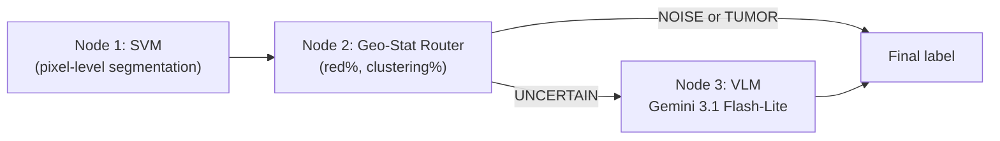

# Machine Learning Boosting via Statistical and Foundation Models in a DAG Architecture

**This code is part of the publication:**

Daniil Mikhailenko, Denis Nikoshin, Lev Matveev, Konstantin Yashin, Sovetsky Alexander, Radik D. Zinatullin, Alexander Matveyev, Vladimir Y. Zaitsev, Nataliya Matveeva,
*"Machine Learning Boosting via Statistical and Foundation Models in a Directed Acyclic Graph Architecture"*, Springer-Nature LNCS, AIST 2026.

Implementation of a **three-node heterogeneous DAG** for binary classification on small medical-imaging datasets: a statistical SVM node (Node 1), a deterministic Geometric-Statistical router (Node 2), and a vision-language foundation-model node (Node 3, Gemini 3.1 Flash-Lite). Unambiguous scans terminate early; only **UNCERTAIN** cases are routed to the VLM — a form of model boosting under data scarcity.

## Motivation

Simple models such as SVM are fast, interpretable, and train well on small datasets, but they **cannot perform perceptual analysis** on their own: they miss morphological cues (thin vertical stripes vs. dense infiltrating clusters) that distinguish segmentation noise from true tumor signal.

Large VLMs excel at visual reasoning, but they **cannot run an SVM inside their architecture** without generating and executing external code. They also tend to be expensive and less stable as standalone classifiers on niche medical imagery.

This project implements **heterogeneous model boosting** in a Directed Acyclic Graph: lightweight statistical nodes handle segmentation and geometric screening; the foundation model is invoked only for ambiguous cases.

## Case study: intraoperative OCT tumor vs. segmentation noise

Validated on 86 *in vivo* intraoperative brain OCT B-scans (44 Normal, 42 Tumor) from the open dataset of Zinatullin et al. [11].

The SVM color-maps tissue into **green** (normal), **yellow** (damaged), and **red** (tumor). On normal tissue the SVM often produces false-positive red artifacts. The binary task: **TUMOR** vs. **NOISE** (segmentation artifact).

## DAG Architecture

Three specialized **nodes** connected by unidirectional edges; confident paths short-circuit to the final label.



| Node | Role |
|---|---|
| **1 — SVM** | RGB segmentation map (green / yellow / red) from structural OCT features |
| **2 — Geo-Stat Router** | Computes `red%` and `clustering%`; heuristic triage; routes ambiguous scans to Node 3 |
| **3 — VLM** | Few-shot 5×5 panel (12 Normal + 12 Tumor + 1 TEST); morphology-based disambiguation |

> In code, Node 2 is implemented as `MathAgent` in [`agents/math_agent.py`](agents/math_agent.py) (`red%`, spatial clustering, rule-based routing). Module names (`agents/`, `*agent.py`) are historical; the paper and this README treat the blocks as **nodes**.

> **Note on terminology and scope.** There is an ongoing debate on what counts as an “agent” versus a conventional software **tool**. In this framework some functional nodes — especially the SVM segmenter and the Geo-Stat router — are purely mathematical/statistical blocks. Much of the literature would classify such deterministic modules as tools rather than autonomous agents; we still treat them as **peer nodes** in a graph-routing system because that is a useful way to structure the cascade. This repository is a **linear three-node DAG** (SVM → Geo-Stat → conditional VLM), not a full multi-agent graph with feedback or ensemble edges. A richer setup with more specialized nodes and explicit extra edges is discussed as future work in the paper; this code is the first concrete step toward it.

**Cascade policy:** the VLM is called only when the Geo-Stat router returns `UNCERTAIN` (~55% of scans in our experiments). Clear cases are resolved without an API call.

### Geo-Stat metrics (Node 2)

| Feature | Definition |
|---|---|
| `red%` | 100 · N_red / N_tissue |
| `clustering%` | 100 · \|C_max\| / N_red (0 if N_red = 0), largest connected red component |

### Geo-Stat routing thresholds

| Rule | Value |
|---|---|
| Red area → NOISE | < 5% |
| Red area → TUMOR | > 30% |
| Uncertainty band | 5–30% |
| Clustering → noise | < 20% |
| Clustering → tumor | ≥ 50% |

## Results (n = 86)

Metrics at the **Youden operating point** (see §2.3 in the paper for probability calibration and ROC construction).

| Configuration | Sens. (%) | Spec. (%) | Acc. (%) | AUROC |
|---|---:|---:|---:|---:|
| Standalone SVM Agent [11] | 83.0 | 85.0 | 84.0 | 0.928 |
| SVM + Gemini 3.1 Pro only [11] | 86.0 | 93.0 | 90.0 | 0.934 |
| SVM + Geo-Stat Agent (Nodes 1 & 2) | 95.2 | 88.6 | 91.9 | 0.938 |
| **Full DAG Cascade (Nodes 1, 2, 3)** | **90.5** | **93.2** | **91.9** | **0.940** |

At equal accuracy (91.9%), the full DAG achieves a **better Sens/Spec balance** than Geo-Stat alone (specificity 93.2% vs. 88.6%) while outperforming both standalone SVM and the all-VLM baseline (90.0% accuracy), with the heavy model invoked only on ambiguous scans.


## Setup

```bash
python3 -m venv .venv
source .venv/bin/activate        # Windows: .venv\Scripts\activate
pip install -r requirements.txt
cp .env.example .env               # set GEMINI_API_KEY locally
```

| Variable | Description | Default |
|---|---|---|
| `GEMINI_API_KEY` | Google AI API key | required for VLM (Node 3) |
| `GEMINI_MODEL` | Model name | `gemini-3.1-flash-lite` |
| `GEMINI_MAX_RPM` | Rate limit (req/min) | `10` |

> Do **not** commit `.env`. It is listed in `.gitignore`. The repository contains **no API keys** and **no proprietary scan data**.

## Dataset

The clinical dataset is **not included** in this repository. Expected layout after download:

```
DATASETS_MDPI/
├── Class1/          # Normal — 44 scans
│   └── *.jpg
└── Class2/          # Tumor — 42 scans
    └── *.jpg
```

Images are intraoperative OCT scans with SVM color overlays. The rightmost ~15% (legend) is excluded by the Geo-Stat node.

## Usage

### Full DAG cascade on the dataset

```bash
python main.py DATASETS_MDPI
```

Outputs:
- `results/pipeline_results.json` — raw node responses
- `results/scans_summary.csv` — per-scan table
- `results/metrics_comparison.csv` — comparison with baselines

### Geo-Stat node only (Nodes 1–2 logic, no VLM API)

```bash
python main.py DATASETS_MDPI --math-only
```

### Single scan

```bash
python main.py "DATASETS_MDPI/Class1/OCT (3)Proc2.jpg"
```

### Preview few-shot 5×5 panel

```bash
python main.py "DATASETS_MDPI/Class1/OCT (3)Proc2.jpg" \
  --preview-panel results/panel_preview.png
```

### ROC evaluation (paper §2.3)

| Script | What it implements |
|---|---|
| [`evaluate_roc.py`](evaluate_roc.py) | LOOCV ROC / Youden on continuous `red%` (Geo-Stat score; auxiliary baseline curve) |
| [`evaluate_geostat_platt_roc.py`](evaluate_geostat_platt_roc.py) | **Nested LOOCV + Platt scaling** for Node 2 — calibrated tumor probabilities without data leakage (paper §2.3) |
| [`evaluate_article_roc.py`](evaluate_article_roc.py) | Combined ROC figure: Geo-Stat Platt curve + Full DAG cascade (`tumor_score` from VLM confidence and fixed extremes) |

```bash
# Geo-Stat Platt ROC (Node 2, as in the paper)
python evaluate_geostat_platt_roc.py

# Combined article figure + summary CSV
python evaluate_article_roc.py

# Basic LOOCV ROC on red%
python evaluate_roc.py DATASETS_MDPI
```

### Regenerate CSV reports from saved JSON

```bash
python generate_reports.py results/pipeline_results.json
```

## CLI options (`main.py`)

| Flag | Description |
|---|---|
| `--math-only` | Skip VLM (Nodes 1–2 only) |
| `--always-vlm` | Call VLM on every scan (disable cascade) |
| `--no-few-shot` | Disable 5×5 exemplar panel |
| `--model NAME` | Override Gemini model |
| `--max-rpm N` | API rate limit per minute |
| `--limit N` | Process only first N images |
| `-o PATH` | Output JSON path |

## Project layout

```
agents/
  math_agent.py      # Node 2: Geo-Stat router (red%, clustering, rules)
  vlm_agent.py       # Node 3: Gemini + prompts
  few_shot.py        # 5×5 exemplar panel (LOOCV-safe sampling)
  pipeline.py        # Full DAG: Geo-Stat → conditional VLM
  reporting.py       # CSV reports and metrics
  rate_limiter.py    # Token-bucket rate limiter
main.py              # CLI entry point
evaluate_roc.py      # LOOCV ROC on red%
evaluate_geostat_platt_roc.py   # Nested LOOCV Platt for Geo-Stat (§2.3)
evaluate_article_roc.py         # Combined ROC figure for the paper
generate_reports.py  # CSV from JSON
results/             # Experiment artifacts (no raw scans)
AIST_ML_BOOSTING_PAPER_V1/   # LaTeX source for the publication
```

## License and data

- Code is provided for research purposes.
- Dataset images are **not** shipped with this repository.
- Store the Gemini API key only in a local `.env` file.

## Funding

This work was supported by the Russian Science Foundation (RSF): RSF Grant № 25-12-20032: "New Approaches to the Development of Algorithms for Analyzing OCT Scans: Modification and Optimization of Large Models Based on Physical Principles and Conditions of OCT Signal Formation" (https://rscf.ru/project/25-12-20032/ (https://rscf.ru/en/project/25-12-20032/))

## Citation

If you use this code, please cite:

Daniil Mikhailenko, Denis Nikoshin, Lev Matveev, Konstantin Yashin, Sovetsky Alexander, Radik D. Zinatullin, Alexander Matveyev, Vladimir Y. Zaitsev, Nataliya Matveeva,
*"Machine Learning Boosting via Statistical and Foundation Models in a Directed Acyclic Graph Architecture"*, Springer-Nature LNCS, AIST 2026.
