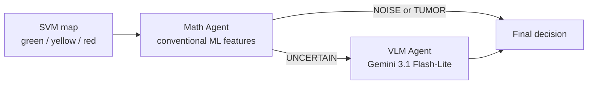

# Agent Cascade for Better Binary Classification on Small Datasets

**Boosting simple models with general-purpose VLMs** — a two-agent cascade that combines conventional ML (SVM segmentation + geometric features) with vision-language reasoning (Gemini) to improve binary classification when data is scarce.

## Motivation

Simple models such as SVM are fast, interpretable, and train well on small datasets, but they **cannot perform perceptual analysis** on their own: they miss morphological cues (thin vertical stripes vs. dense infiltrating clusters) that distinguish segmentation noise from true tumor signal.

Large VLMs excel at visual reasoning, but they **cannot run an SVM inside their architecture** — at least not without generating and executing external code. They also tend to be expensive and less stable as standalone classifiers on niche medical imagery.

This project explores a middle ground: **agent boosting** — let the simple model handle what it does best (pixel-level segmentation and cheap numeric screening), and delegate only ambiguous cases to a VLM. Better performance comes from **combining conventional ML methods with VLM models**, not from replacing one with the other.

> **Note on scope.** This is a **linear two-agent cascade**, not a full agent graph yet. A richer setup would involve more specialized agents and explicit edges between them (routing, feedback, ensemble). That direction is planned; this repository is the first step toward it.

## Case study: intraoperative OCT tumor vs. segmentation noise

The SVM color-maps tissue into **green** (normal), **yellow** (damaged), and **red** (tumor). On normal tissue the SVM often produces false-positive red artifacts. The binary task: **TUMOR** vs. **NOISE** (artifact).

## Architecture



| Agent | Role | Strength used |
|---|---|---|
| **Math Agent** | Red-area %, spatial clustering, rule-based triage | Cheap, deterministic, no API |
| **VLM Agent** | Morphology check with few-shot 5×5 panel (12 Normal + 12 Tumor + 1 TEST) | Perceptual reasoning on hard cases |

**Cascade policy:** the VLM is called only when the Math Agent returns `UNCERTAIN` (~55% of scans). Clear cases are resolved without an API call — a practical form of boosting on a small dataset (n = 86).

## Results (n = 86)

| Method | Sensitivity | Specificity | Accuracy |
|---|---:|---:|---:|
| SVM (baseline) [11] | 83.0% | 85.0% | 84.0% |
| Gemini 3.1 Pro alone (baseline) [11] | 86.0% | 93.0% | 90.0% |
| Neurosurgeons (HITL) [11] | 98.0% | 90.0% | 94.0% |
| Math Agent only | 90.5% | 88.6% | 89.5% |
| **Math + Gemini cascade (ours)** | **90.5%** | **93.2%** | **91.9%** |

The cascade matches Math Agent sensitivity while **recovering specificity** lost without the VLM (+4.6 pp vs. Math alone), and beats both published SVM and Gemini-Pro baselines on accuracy.

Routing: 39 Math-only decisions (45%), 47 VLM calls (55%).


## Setup

```bash
python3 -m venv .venv
source .venv/bin/activate        # Windows: .venv\Scripts\activate
pip install -r requirements.txt
cp .env.example .env               # set GEMINI_API_KEY locally
```

| Variable | Description | Default |
|---|---|---|
| `GEMINI_API_KEY` | Google AI API key | required for VLM |
| `GEMINI_MODEL` | Model name | `gemini-3.1-flash-lite` |
| `GEMINI_MAX_RPM` | Rate limit (req/min) | `10` |

> Do **not** commit `.env`. It is listed in `.gitignore`.

## Dataset

The clinical dataset is **not included** in this repository (pending release approval). Expected layout:

```
DATASETS_MDPI/
├── Class1/          # Normal — 44 scans, no tumor
│   └── *.jpg
└── Class2/          # Tumor — 42 scans, confirmed infiltration
    └── *.jpg
```

Images are intraoperative OCT scans with SVM color overlays. The rightmost ~15% (legend) is excluded by the Math Agent.

## Usage

### Full cascade on the dataset

```bash
python main.py DATASETS_MDPI
```

Outputs:
- `results/pipeline_results.json` — raw agent responses
- `results/scans_summary.csv` — per-scan table
- `results/metrics_comparison.csv` — comparison with baselines

### Math Agent only (no API)

```bash
python main.py DATASETS_MDPI --math-only
```

### Single scan

```bash
python main.py "DATASETS_MDPI/Class1/OCT (3)Proc2.jpg"
```

### Preview few-shot 5×5 panel

```bash
python main.py "DATASETS_MDPI/Class1/OCT (3)Proc2.jpg" \
  --preview-panel results/panel_preview.png
```

### LOOCV ROC for Math Agent (continuous red% score)

```bash
python evaluate_roc.py DATASETS_MDPI
```

Writes `results/roc/loocv_summary.csv`, `loocv_predictions.csv`, `math_agent_roc.png`.

### Regenerate CSV reports from saved JSON

```bash
python generate_reports.py results/pipeline_results.json
```

## CLI options (`main.py`)

| Flag | Description |
|---|---|
| `--math-only` | Skip VLM |
| `--always-vlm` | Call VLM on every scan (disable cascade) |
| `--no-few-shot` | Disable 5×5 exemplar panel |
| `--model NAME` | Override Gemini model |
| `--max-rpm N` | API rate limit per minute |
| `--limit N` | Process only first N images |
| `-o PATH` | Output JSON path |

## Project layout

```
agents/
  math_agent.py      # Area %, clustering, decision rules
  vlm_agent.py       # Gemini + prompts
  few_shot.py        # 5×5 exemplar panel
  pipeline.py        # Math → VLM cascade
  reporting.py       # CSV reports and metrics
  rate_limiter.py    # Token-bucket rate limiter
main.py              # CLI entry point
evaluate_roc.py      # LOOCV ROC / Youden
generate_reports.py  # CSV from JSON
results/             # Experiment artifacts
```

## Math Agent thresholds

| Rule | Value |
|---|---|
| Red area → NOISE | < 5% |
| Red area → TUMOR | > 30% |
| Uncertainty band | 5–30% |
| Clustering → noise | < 20% |
| Clustering → tumor | ≥ 50% |

Full logic: [`agents/math_agent.py`](agents/math_agent.py).

## License and data

- Code is provided for research purposes.
- Dataset is withheld until separate approval.
- Store the Gemini API key only in local `.env`.
Funding This dataset was curated and published with the support of the Russian Science Foundation (RSF): RSF Grant № 25-12-20032: "New Approaches to the Development of Algorithms for Analyzing OCT Scans: Modification and Optimization of Large Models Based on Physical Principles and Conditions of OCT Signal Formation" (https://rscf.ru/en/project/25-12-20032/)

